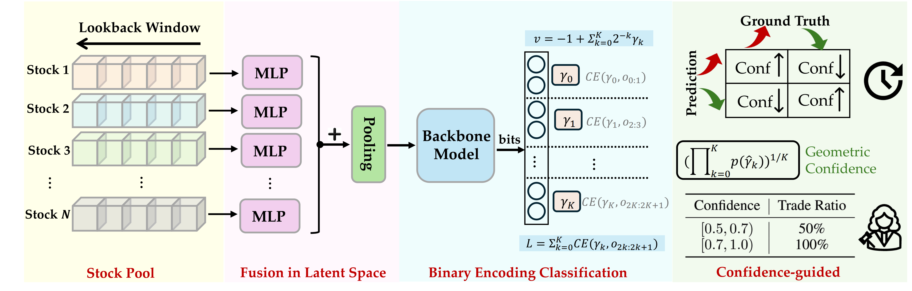
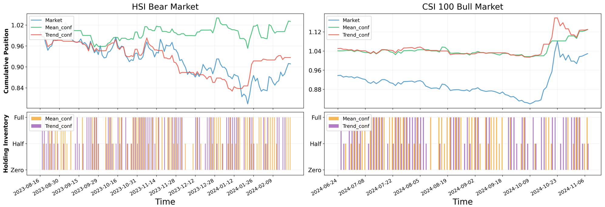

# Cubic : Why Regression? Predicting Index Price with Stock Component Fusion and Binary Encoding Classification
This repo provides the code for reproducing the stock index prediction in the IJCAI'25 submission 

Overview of the Relaver framework


### Dependencies
```
Python: 3.10.13
Stable-Baselines3: 2.3.2
PyTorch: 2.2.1+cpu
GPU Enabled: False
Numpy: 1.26.4
Cloudpickle: 3.0.0
Gymnasium: 0.29.1
OpenAI Gym: 0.26.2
yfinance 0.2.3
finrl 0.3.5 
```

### Usage
We provide the RElaver implementation on three major stock index across the world: USA (DJIA), China (CSI 100). 
To execute the training and evaluation, specify the ``<Market name>`` (``USA`` or ``China``) first and execute st_run.sh:

```shell
st_run.sh --market <market_name>
```
The testing results on four major Chinese stock index option and the corresponding case studies are as follows:





