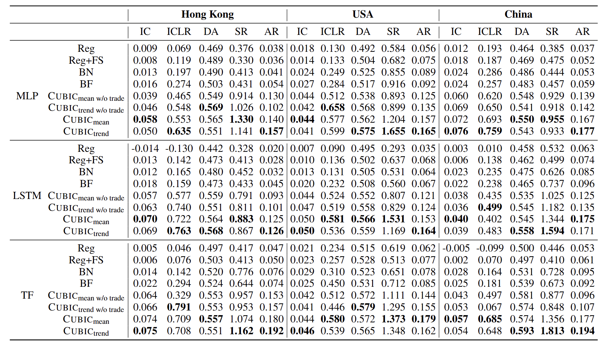

# Cubic : Why Regression? Predicting Index Price with Stock Component Fusion and Binary Encoding Classification
This repo provides the code for reproducing the stock index prediction in the IJCAI'25 submission 

Overview of the Cubic framework


### Dependencies
```
Python==3.10.13
PyTorch==2.2.1
numpy==1.26.4
pandas>=2.0.0
cloudpickle==3.0.0
yfinance==0.2.3
finrl==0.3.5
cupy  # Optional: Only if GPU support is needed
scipy>=1.10.0
matplotlib>=3.7.0
```

### Usage
We provide the RElaver implementation on three major stock index across the world: USA (DJIA), China (CSI 100). 
To execute the training and evaluation, specify the ``<Market name>`` (``USA`` or ``China``) first and execute st_run.sh:

```shell
st_run.sh --market <market_name>
```
The testing results on major stock index and the corresponding case studies are as follows:




